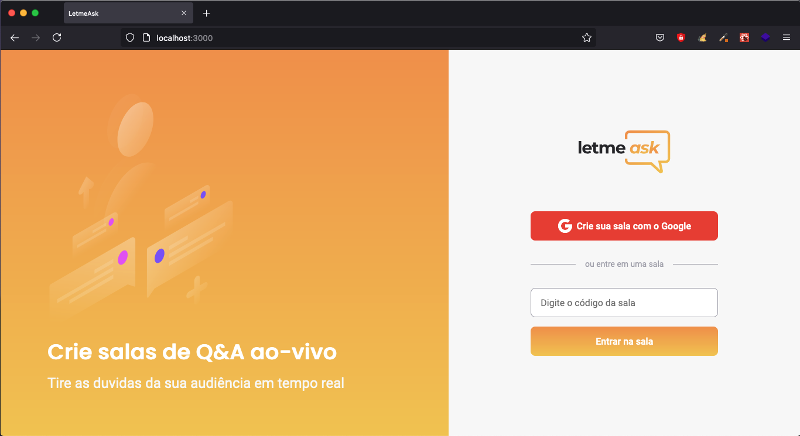

<h1 align="center">
  
</h1>
<h4 align="center">
    Participei da #NLW/Together da Rocketseat :rocket:. Desenvolvendo em uma semana uma aplicação com #FrontEnd
</h4>  

  

## ✨ Tecnologias

esse projeto foi desenvolvido com as seguintes Tecnologias:

- [React](https://reactjs.org)
- [Firebase](https://firebase.google.com/)
- [TypeScript](https://www.typescriptlang.org/)

## 💻 O Projeto

LetAsk é um Projeto voltado para Perguntas e Resposta de um determinado assunto.

## 🚀 Como executar o Projeto

- Clone o repositório
- Instale as dependências com `yarn`
- Inicie o Projeto com `yarn start`

#Feito com ♥ Graças a  Rocketseat 👋🏻
